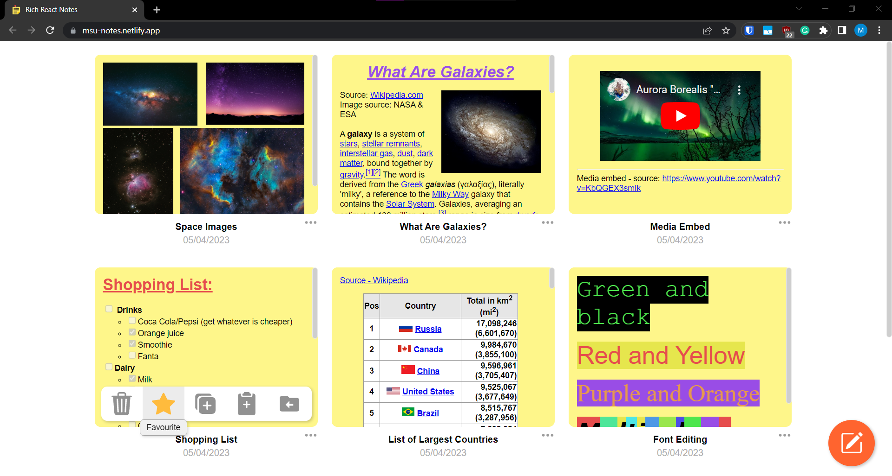
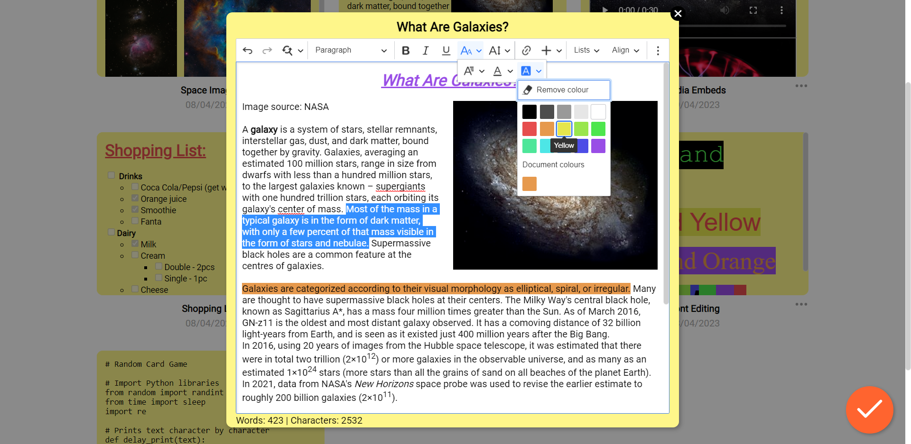

# React-Notes-App
## Test the program: https://msu-notes.netlify.app/

### Current features:
- Add, edit, and delete notes (data saves to Local Storage)
- A rich-text editor which allows for a variety of formatting options, image uploads, and media embeds
- Search function - by title, content, and date
- Animations
- Responsive CSS based on window size
- Reset notes to default examples

### Notes: 
- Only the delete and duplicate functions are implemented from the note options panel.
- I considered and researched good UX design to implement in the program
- Extensions, such as Grammarly, can slow down the editor

### Future update ideas:
- Implement all other note functions from the note options panel (and add confirmation modal when delete is clicked)
- Ability to create folders and sort notes with them
- Dark mode
- Custom note colours
- Sort notes button - by date created, modified, and title
- Implement useContext
- Fix CSS and add some more animations

*Favicon image edited from an [Icon](https://freeicons.io/notes-and-tasks-flat-icon/note-icon-24975) published by [Muhammad Haq](https://freeicons.io/profile/823 "Publisher's profile") at www.freeicons.io.*
