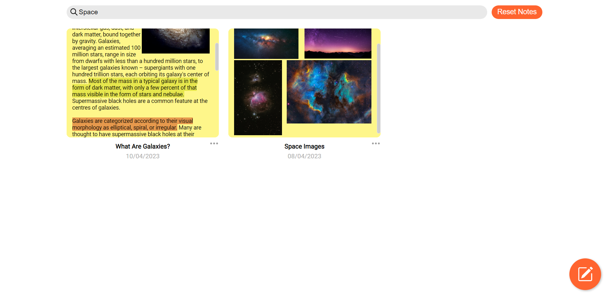
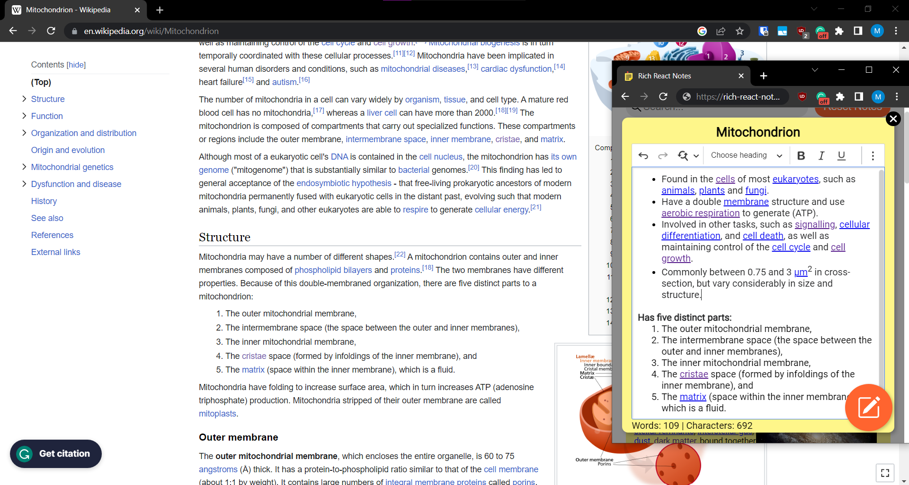

# Rich React Notes
## Test the program: https://rich-react-notes.pages.dev/

### Tech Stack
React  •  HTML  •  CSS  •  Vite  •  Node.js

### Current features:
- Add, edit, and delete notes (data saves to Local Storage)
- A rich-text editor which allows for a variety of formatting options, image uploads, and media embeds
- Search function - by title, content, and date
- Animations
- Responsive CSS based on window size
- Reset notes to default examples

### Notes:
- Only the delete and duplicate functions are implemented from the note options panel.
- I considered and researched good UX design to implement in the program
- Extensions, such as Grammarly, can slow down the editor
- Notes may reset without you clicking "Reset Notes" or manually clearing local storage because I may reset them after changing noteExamples.json.

### Future update ideas:
- Implement all other note functions from the note options panel
- Add recycle bin folder - where notes are truly deleted after a duration of time, or if the user manually does so
- Ability to create folders and sort notes with them
- Dark mode
- Custom note colours
- Sort notes button - by date created, modified, and title
- Fix CSS and add some more animations
- User login and cloud storage, so that saved notes can be accessed from different devices

*Favicon image edited from an icon published by Muhammad Haq at www.freeicons.io.*
